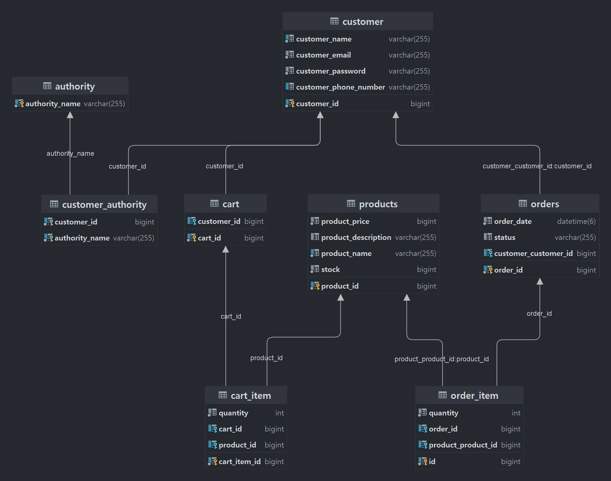

# commerce
회원, 상품, 주문과 장바구니

## 테이블
* 회원정보

* 상품정보

* 장바구니 정보

* 장바구니 상품정보

* 주문정보

* 주문 상품정보

## 필요 API
* 회원가입, 로그인 API

* 상품 관련 API

* 장바구니 관련 API

* 주문관련 API

# 프로젝트 진행 방식

- [x] ERD 설계

- [x] 테이블 설계
  - 
- [x] 프로젝트 세팅
  - Java 11, Spring 2.7.16
  - MySQL, Postman
- [x] 로그인 / 회원가입 api 개발
  - JWT, Spring Security
- [x] 상품, 장바구니, 주문 api 개발
  - 상품, 장바구니, 조회 CRUD
---
# 회원 가입
- https://jonggae.tistory.com/134
- https://jonggae.tistory.com/135

JWT를 이용한 로그인 인증 방식을 사용하였음.

* basic header로 전송되는 암호화된 username, password (HTTPS는 미구현)
* UsernamePasswordAuthenticationToken
* Authentication 객체 내의 사용자 정보를 통해 Contoller에 정보를 전달한다.
* 

