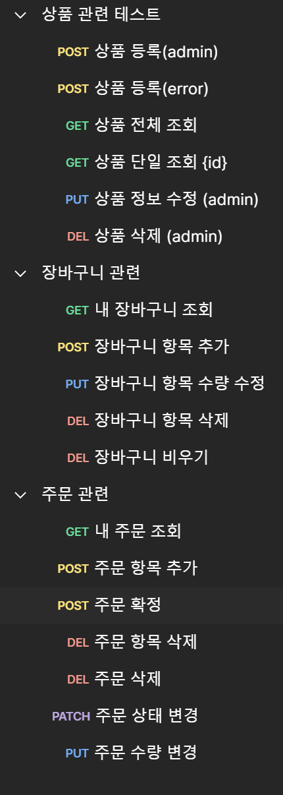

# commerce
회원, 상품, 주문과 장바구니

## 테이블
* 회원정보

* 상품정보

* 장바구니 정보

* 장바구니 상품정보

* 주문정보

* 주문 상품정보

## 필요 API
* 회원가입, 로그인 API

* 상품 관련 API

* 장바구니 관련 API

* 주문관련 API

# 프로젝트 진행 방식

- [x] ERD 설계

- [x] 테이블 설계
  - 
- [x] 프로젝트 세팅
  - Java 11, Spring 2.7.16
  - MySQL, Postman
- [x] 로그인 / 회원가입 api 개발
  - JWT, Spring Security
- [x] 상품, 장바구니, 주문 api 개발
  - 상품, 장바구니, 조회 CRUD
---
# 회원 가입
- https://jonggae.tistory.com/134
- https://jonggae.tistory.com/135
# 로그인

JWT를 이용한 로그인 인증 방식을 사용하였음.

* basic header로 전송되는 암호화된 username, password (HTTPS는 미구현)
* Authentication 객체 내의 사용자 정보를 통해 Contoller에 정보를 전달한다.

* JwtAuthenticationFilter 를 통하여 로그인 과정이 진행된다.
  * LoginProvider는 입력받은 username, password를 DB에 저장된 정보와 대조하여 일치하는지 확인한다.  
  * 로그인 요청과 DB의 정보가 일치한다면 인증이 완료된다.
  * 이후 LoginSuccessHandler를 통해 JWT 토큰을 생성하여 애플리케이션 내에서 사용할 수 있다.
  * 다른 로그인 정보 (ADMIN, 다른 유저)도 동일하게 동작한다.

# 이후 과정
* 회원은 로그인 시 얻은 토큰을 가지고 다양한 접근을 시도할 수 있다.
  * 상품
  * 장바구니
  * 주문 
* 각 도메인에 해당하는 CRUD 를 할 수 있고, ADMIN 유저는 상품을 등록하거나 주문을 취소 하는 등 
관리자의 입장에서 필요한 접근을 할 수 있다.

* 프로젝트의 개발 조건은 여기까지이며, 이후 개인적인 리팩토링과 기능 추가 등을 시행하였다.

---
# 리팩토링 사항

* 두서없이 분산되어 있던 예외 처리를 한곳에 정리해주었다. // https://jonggae.tistory.com/136
* Api 요청 시, 반환되는 응답의 형식을 일관성있게 변경하였다.
* 다양한 도메인의 Controller 에서 User의 정보가 필요한 부분이 있었는데 이것을 Authentication 객체에서 가져올 수 있도록 변경하였다.
* Order 도메인에서 난잡한 서비스 로직을 DDD 형태로 변경하고, 가독성을 높였다.
* 다른 기타 도메인에서도 같은 작업을 진행한다. // https://jonggae.tistory.com/139
* Postman으로 테스트를 계속 진행했지만, Swagger도 사용할 수 있도록 추가하였음.

